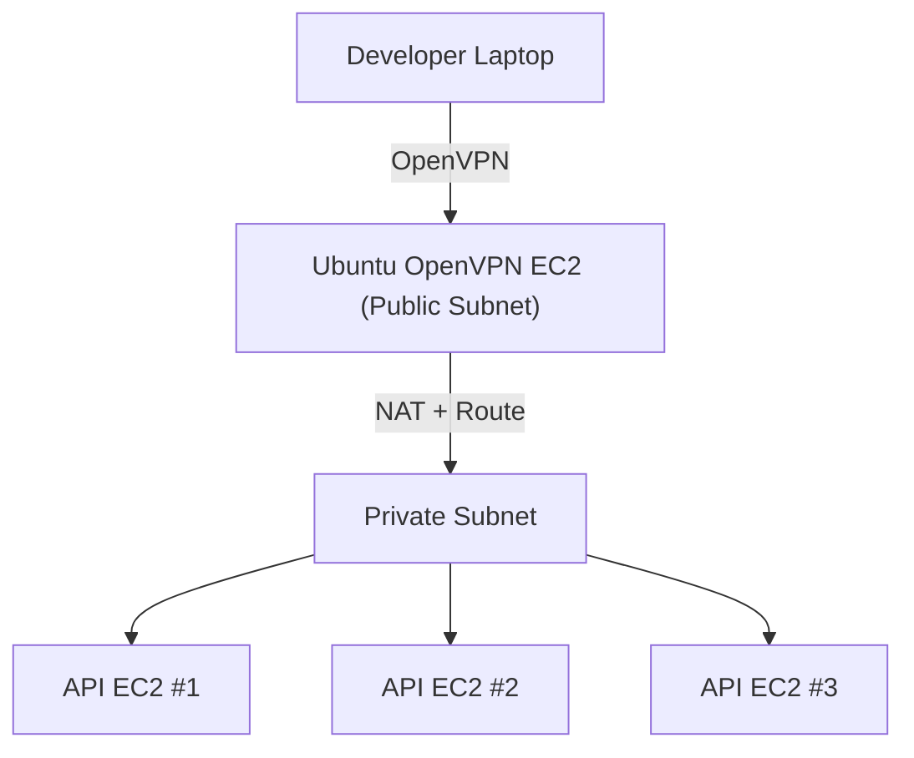

# ☁️ AWS CDK (v2) — Linux OpenVPN Infrastructure

This CDK stack builds the **Linux + OpenVPN** version of the VPN infrastructure on AWS. It automatically deploys:

* 1 VPC with **public** and **private** subnets + NAT
* 1 **Ubuntu EC2 (OpenVPN Server)** in the public subnet with Elastic IP
* 3 **Private API EC2 instances** in the private subnet
* **Security groups**, routing, and automatic OpenVPN installation

---

## 🗺️ Architecture



---

## 🧩 Features

✅ Automatically builds full AWS network topology
✅ Launches and configures OpenVPN server (userData setup)
✅ Generates a `client1.ovpn` on `/home/ubuntu` (ready to SCP)
✅ Provides Elastic IP for VPN connection
✅ Pushes route to private subnet `10.0.2.0/24`
✅ NAT allows VPN users access to private APIs without exposure

---

## ⚙️ Setup Instructions

1. **Create project:**

   ```bash
   mkdir cdk-openvpn && cd cdk-openvpn
   cdk init app --language typescript
   ```

2. **Install dependencies:**

   ```bash
   npm install aws-cdk-lib constructs
   ```

3. **Replace** contents of `lib/openvpn-stack.ts` with the code below.

4. **Deploy:**

   ```bash
   cdk bootstrap
   cdk deploy
   ```

5. After deployment, note the **Elastic IP** from stack outputs — that’s your VPN endpoint.

6. SSH into your OpenVPN server and retrieve `/home/ubuntu/client1.ovpn`:

   ```bash
   scp -i your-key.pem ubuntu@<Elastic-IP>:/home/ubuntu/client1.ovpn ./
   ```

7. Update the `remote` line in the `.ovpn` file to your Elastic IP (if not set automatically).

---

## 🧱 CDK Stack — `lib/openvpn-stack.ts`

```ts
import * as cdk from 'aws-cdk-lib';
import { Construct } from 'constructs';
import * as ec2 from 'aws-cdk-lib/aws-ec2';
import * as iam from 'aws-cdk-lib/aws-iam';

export interface OpenVpnStackProps extends cdk.StackProps {
  sshKeyName: string;
  adminCidr?: string;
}

export class OpenVpnStack extends cdk.Stack {
  constructor(scope: Construct, id: string, props: OpenVpnStackProps) {
    super(scope, id, props);

    const adminCidr = props.adminCidr ?? '0.0.0.0/0';
    if (!props.sshKeyName) throw new Error('Please provide sshKeyName');

    // 🏗️ 1. Create VPC
    const vpc = new ec2.Vpc(this, 'OpenVpnVpc', {
      ipAddresses: ec2.IpAddresses.cidr('10.0.0.0/16'),
      maxAzs: 1,
      natGateways: 1,
      subnetConfiguration: [
        { name: 'Public', subnetType: ec2.SubnetType.PUBLIC, cidrMask: 24 },
        { name: 'Private', subnetType: ec2.SubnetType.PRIVATE_WITH_EGRESS, cidrMask: 24 },
      ],
    });

    // 🧱 2. Security Groups
    const sgOpenVpn = new ec2.SecurityGroup(this, 'OpenVpnSG', {
      vpc,
      description: 'OpenVPN and SSH access',
      allowAllOutbound: true,
    });
    sgOpenVpn.addIngressRule(ec2.Peer.anyIpv4(), ec2.Port.udp(1194), 'OpenVPN UDP');
    sgOpenVpn.addIngressRule(ec2.Peer.ipv4(adminCidr), ec2.Port.tcp(22), 'SSH');

    const sgApi = new ec2.SecurityGroup(this, 'ApiSG', {
      vpc,
      description: 'Private API SG',
      allowAllOutbound: true,
    });
    sgApi.addIngressRule(ec2.Peer.ipv4('10.8.0.0/24'), ec2.Port.tcp(80), 'HTTP from VPN');
    sgApi.addIngressRule(ec2.Peer.ipv4('10.8.0.0/24'), ec2.Port.tcp(443), 'HTTPS from VPN');

    // 🔐 3. IAM Role
    const openVpnRole = new iam.Role(this, 'OpenVpnRole', {
      assumedBy: new iam.ServicePrincipal('ec2.amazonaws.com'),
    });
    openVpnRole.addManagedPolicy(iam.ManagedPolicy.fromAwsManagedPolicyName('AmazonSSMManagedInstanceCore'));

    // ☁️ 4. Ubuntu 22.04 AMI
    const ubuntuAmi = ec2.MachineImage.lookup({
      name: 'ubuntu/images/hvm-ssd/ubuntu-jammy-22.04-amd64-server-*',
      owners: ['099720109477'],
    });

    // 🧩 5. OpenVPN User Data
    const userData = ec2.UserData.forLinux();
    userData.addCommands(
      'apt-get update -y',
      'DEBIAN_FRONTEND=noninteractive apt-get install -y openvpn easy-rsa iptables-persistent',
      'make-cadir /etc/openvpn/easy-rsa',
      'cd /etc/openvpn/easy-rsa',
      'EASYRSA_BATCH=1 ./easyrsa init-pki',
      'EASYRSA_BATCH=1 ./easyrsa build-ca nopass',
      'EASYRSA_BATCH=1 ./easyrsa gen-req server nopass',
      'EASYRSA_BATCH=1 ./easyrsa sign-req server server',
      './easyrsa gen-dh',
      'openvpn --genkey --secret ta.key',
      'EASYRSA_BATCH=1 ./easyrsa gen-req client1 nopass',
      'EASYRSA_BATCH=1 ./easyrsa sign-req client client1',
      'cp pki/ca.crt pki/issued/server.crt pki/private/server.key pki/dh.pem ta.key /etc/openvpn/',
      'cp pki/issued/client1.crt pki/private/client1.key /etc/openvpn/',
      'cat > /etc/openvpn/server.conf <<EOF',
      'port 1194',
      'proto udp',
      'dev tun',
      'ca /etc/openvpn/ca.crt',
      'cert /etc/openvpn/server.crt',
      'key /etc/openvpn/server.key',
      'dh /etc/openvpn/dh.pem',
      'tls-auth /etc/openvpn/ta.key 0',
      'server 10.8.0.0 255.255.255.0',
      'push "route 10.0.2.0 255.255.255.0"',
      'keepalive 10 120',
      'cipher AES-256-CBC',
      'user nobody',
      'group nogroup',
      'persist-key',
      'persist-tun',
      'status /var/log/openvpn-status.log',
      'verb 3',
      'EOF',
      'sed -i "s/#net.ipv4.ip_forward=1/net.ipv4.ip_forward=1/" /etc/sysctl.conf',
      'sysctl -p',
      'iptables -t nat -A POSTROUTING -s 10.8.0.0/24 -o eth0 -j MASQUERADE',
      'sh -c "iptables-save > /etc/iptables/rules.v4"',
      'systemctl enable openvpn@server',
      'systemctl start openvpn@server',
      'echo "client\ndev tun\nproto udp\nremote <EIP> 1194\nresolv-retry infinite\nnobind\npersist-key\npersist-tun\nremote-cert-tls server\ncipher AES-256-CBC\nverb 3" > /home/ubuntu/client1.ovpn',
      'echo "<ca>" >> /home/ubuntu/client1.ovpn && cat /etc/openvpn/ca.crt >> /home/ubuntu/client1.ovpn && echo "</ca>" >> /home/ubuntu/client1.ovpn',
      'echo "<cert>" >> /home/ubuntu/client1.ovpn && cat /etc/openvpn/client1.crt >> /home/ubuntu/client1.ovpn && echo "</cert>" >> /home/ubuntu/client1.ovpn',
      'echo "<key>" >> /home/ubuntu/client1.ovpn && cat /etc/openvpn/client1.key >> /home/ubuntu/client1.ovpn && echo "</key>" >> /home/ubuntu/client1.ovpn',
      'echo "<tls-auth>" >> /home/ubuntu/client1.ovpn && cat /etc/openvpn/ta.key >> /home/ubuntu/client1.ovpn && echo "</tls-auth>" >> /home/ubuntu/client1.ovpn',
      'chown ubuntu:ubuntu /home/ubuntu/client1.ovpn && chmod 600 /home/ubuntu/client1.ovpn'
    );

    // 🚀 6. OpenVPN EC2 Instance
    const openVpnInstance = new ec2.Instance(this, 'OpenVpnInstance', {
      vpc,
      vpcSubnets: { subnetType: ec2.SubnetType.PUBLIC },
      instanceType: ec2.InstanceType.of(ec2.InstanceClass.T3, ec2.InstanceSize.SMALL),
      machineImage: ubuntuAmi,
      keyName: props.sshKeyName,
      securityGroup: sgOpenVpn,
      role: openVpnRole,
      userData,
    });

    const eip = new ec2.CfnEIP(this, 'OpenVpnEip', { domain: 'vpc' });
    new ec2.CfnEIPAssociation(this, 'EipAssoc', {
      eip: eip.ref,
      instanceId: openVpnInstance.instanceId,
    });

    // 🖥️ 7. Private API Instances
    const apiPrivateIps = ['10.0.2.10', '10.0.2.11', '10.0.2.12'];
    for (let i = 0; i < 3; i++) {
      new ec2.Instance(this, `ApiInstance${i + 1}`, {
        vpc,
        vpcSubnets: { subnetType: ec2.SubnetType.PRIVATE_WITH_EGRESS },
        instanceType: ec2.InstanceType.of(ec2.InstanceClass.T3, ec2.InstanceSize.MICRO),
        machineImage: ubuntuAmi,
        keyName: props.sshKeyName,
        securityGroup: sgApi,
        privateIpAddress: apiPrivateIps[i],
      });
    }

    new cdk.CfnOutput(this, 'OpenVpnEIP', { value: eip.ref });
    new cdk.CfnOutput(this, 'ApiPrivateIps', { value: apiPrivateIps.join(', ') });
  }
}
```

---

## 🧾 Outputs

| Output          | Description                                   |
| --------------- | --------------------------------------------- |
| `OpenVpnEIP`    | Elastic IP for connecting via OpenVPN         |
| `ApiPrivateIps` | Internal IPs of the private API EC2 instances |

---

## 🧠 Summary

✅ 1-click deployment of complete VPN+Private API infra
✅ Simple to manage — no AMI import, no OPNsense
✅ Beginner-friendly OpenVPN config with `.ovpn` file ready to use
✅ Secure private subnet routing for internal APIs
