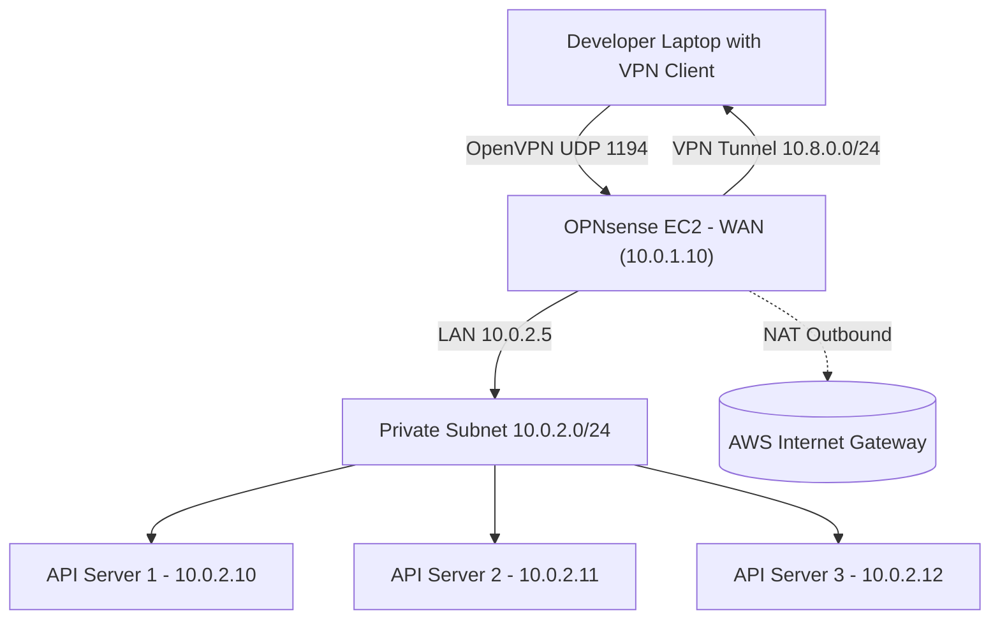

# 🐿️ OPNsense OpenVPN Setup Guide (AWS Infrastructure)

This guide provides a **click-by-click walkthrough** for setting up **OpenVPN on OPNsense** running on an AWS EC2 instance, secured behind a public IP, and providing VPN access to a private subnet.

---

## 📏 1. Initial Access & Interface Setup

1. Login to OPNsense Web UI:

   * URL: `https://<opnsense_public_ip>/`
   * Default credentials:

     * **User:** `root`
     * **Pass:** `opnsense`

2. Go to **Interfaces → Assignments**:

   * Verify:

     * `WAN` = Public ENI (10.0.1.10)
     * `LAN` = Private ENI (10.0.2.5)
   * Click **Save** and **Apply Changes**.

3. Optional configuration:

   * Go to **System → Settings → General** and set:

     * DNS server: `1.1.1.1`
     * Timezone: `Europe/London`

---

## 🔧 2. Create the Certificate Authority (CA)

**Menu:** `VPN → OpenVPN → Servers → Wizards`

1. Select **"Create new Certificate Authority"**
2. Fill out:

   * Descriptive Name: `Local-CA`
   * Key Length: `2048`
   * Lifetime: `3650`
   * Common Name: `OPNsense-CA`
3. Click **Next**

---

## 📢 3. Create the Server Certificate

1. Under “Create a Server Certificate”:

   * Choose: “Create an internal Certificate”
   * Descriptive Name: `OpenVPN-Server`
   * Common Name: `openvpn-server`
   * Certificate Type: **Server Certificate**
   * Lifetime: `3650`
2. Click **Next**

---

## 🔑 4. Configure the OpenVPN Server

1. **Type of Server:** `Remote Access (User Auth)`
2. **Protocol:** `UDP`
3. **Device Mode:** `tun`
4. **Interface:** `WAN`
5. **Local Port:** `1194`
6. **Description:** `OpenVPN-WAN`
7. **TLS Auth:** Checked
8. **Tunnel Settings:**

   * IPv4 Tunnel Network: `10.8.0.0/24`
   * IPv4 Local Network: `10.0.2.0/24`
   * Redirect Gateway: Checked
9. **Advanced Configuration:**

   ```
   push "route 10.0.2.0 255.255.255.0"
   ```
10. **Compression:** Disabled
11. **Save & Next**

---

## 🕵️ 5. Create Local User(s)

**Menu:** `System → Access → Users → + Add`

1. Username: `developer1`
2. Set Password
3. Check **“Create Certificate for this user”**

   * Certificate Authority: `Local-CA`
   * Certificate Type: `User Certificate`
4. Click **Save** → **Apply Changes**

Repeat for each user.

---

## 🔒 6. Firewall Rules

1. **Allow OpenVPN traffic on WAN:**

   * `Firewall → Rules → WAN → + Add`
   * Protocol: UDP, Port: 1194
   * Source: any → Destination: this firewall
   * Action: Pass

2. **Allow VPN traffic:**

   * `Firewall → Rules → OpenVPN → + Add`
   * Protocol: any, Source: OpenVPN net, Destination: any
   * Action: Pass

3. Apply Changes

---

## 🔢 7. NAT (Outbound)

1. Go to `Firewall → NAT → Outbound`
2. Set mode to **Hybrid outbound NAT**
3. Add new rule:

   * Interface: `WAN`
   * Source: `10.8.0.0/24`
   * Translation / Address: `Interface address`
   * Description: `NAT for VPN clients`
4. Save & Apply Changes

---

## 🔄 8. Enable the OpenVPN Server

**Menu:** `VPN → OpenVPN → Servers`

* Ensure the server entry is **enabled** (play ▶️ icon)

---

## 🔍 9. Install the Client Export Plugin

**Menu:** `System → Firmware → Plugins`

1. Find `os-openvpn-client-export`
2. Click **+ Install**
3. Reboot if prompted

---

## 📄 10. Generate .ovpn Client Config

**Menu:** `VPN → OpenVPN → Client Export`

Set:

| Option                       | Value                               |
| ---------------------------- | ----------------------------------- |
| Remote Access Server         | `OpenVPN-WAN`                       |
| Host Name Resolution         | `Interface IP Address` (Elastic IP) |
| Use Random Local Port        | ✅                                   |
| Password Protect Certificate | ❌                                   |
| Certificate Export Options   | Inline Configuration                |

Then scroll down and for each user, click:

**Inline Configurations → Most Clients (Inline Config)**

This downloads: `developer1-udp-1194-aws.ovpn`

---

## 🛠️ 11. Test VPN Connection

1. Install **OpenVPN GUI** (Windows/Mac/Linux)
2. Import `.ovpn` file
3. Connect → Check for *Initialization Sequence Completed*
4. Test connectivity:

   ```bash
   ping 10.0.2.10
   ```

---

## 🔺 Optional: Allow WebGUI over VPN

**Firewall → Rules → OpenVPN → + Add**

* Source: `OpenVPN net`
* Destination: `This Firewall`
* Protocol: TCP Port 443
* Action: Pass

---

## 🗟️ Mermaid Network Diagram



---

## 🏁 Summary

✅ Local CA & user certificates created
✅ OpenVPN server configured for UDP/1194
✅ Local user authentication only
✅ Outbound NAT and firewall rules applied
✅ .ovpn client exports ready for developer use
✅ VPN clients can securely reach private EC2s without public exposure
